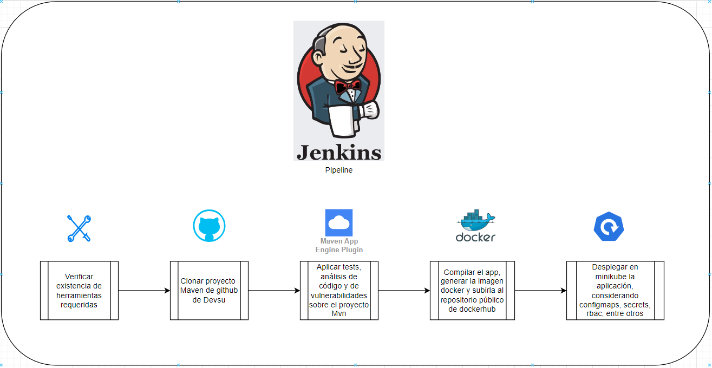
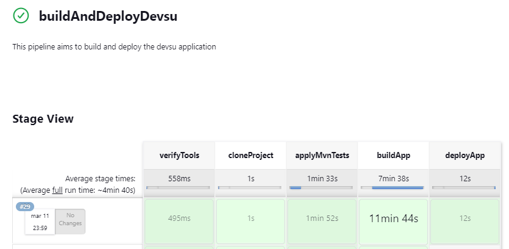
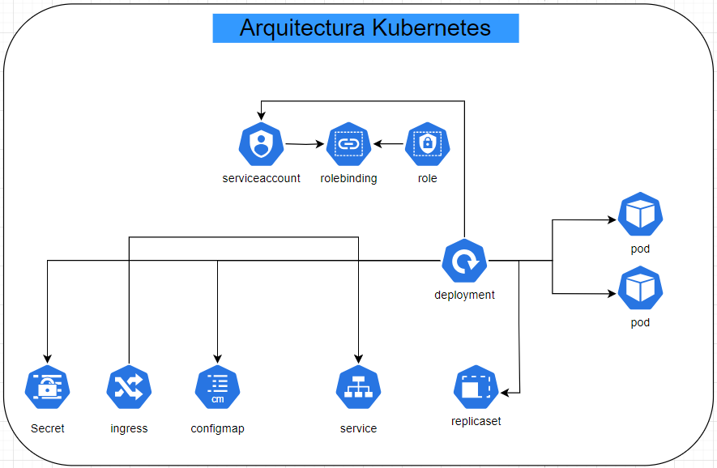

# Prueba Técnica Devsu

Este repositorio contiene todos los artefactos utilizados para llevar a cabo la prueba técnica/práctica encomendada por Devsu. A continuación, se detallan los aspectos del desarrollo y algunos diagramas ilustrativos.

## 1. Diagrama de Implementación del Pipeline en Jenkins

El pipeline consta de 5 stages:

- **verifyTools:** Verifica la instalación de las herramientas necesarias.
- **cloneProject:** Clona el proyecto Maven del repositorio de GitHub de Devsu.
- **applyMvnTests:** Aplica varios tests sobre el proyecto Maven, incluyendo Unit tests, Static code analysis, Code coverage y Vulnerability scan.
- **buildApp:** Compila la aplicación de Devsu, genera una imagen Docker y la sube a DockerHub.
- **deployApp:** Despliega la aplicación en Kubernetes.





## 2. Diagrama de Arquitectura de Kubernetes

El diagrama muestra la arquitectura de la implementación en Kubernetes, creando diversos recursos como namespace, configmap, secret, serviceaccount, role, rolebinding, ingress, service y deployment.



## 3. Instrucciones de Despliegue

Sigue estos pasos para desplegar la aplicación:

- Crea un pipeline en Jenkins.
- Incluye todos los archivos y directorios del repositorio en el directorio workspace.
- Añade el siguiente código a tu pipeline:

```groovy
pipeline {
    agent any

    stages {
        stage('verifyTools') {
            options {
                timeout(time: 1, unit: "MINUTES")
            }
            steps {
                sh './verifyTools.sh'
            }
        }
        stage('cloneProject') {
            options {
                timeout(time: 5, unit: "MINUTES")
            }
            steps {
                sh './cloneRepo.sh'
            }
        }
        stage('applyMvnTests') {
            options {
                timeout(time: 30, unit: "MINUTES")
            }
            steps {
                sh './addPluggins.sh'
                sh './executeTests.sh'
            }
        }
        stage('buildApp') {
            options {
                timeout(time: 30, unit: "MINUTES")
            }
            steps {
                dir('docker') {
                sh './buildImage.sh'
                }
            }
        }
            stage('deployApp') {
            options {
                timeout(time: 30, unit: "MINUTES")
            }
            steps {
                dir('k8s') {
                sh './createResourcesk8s.sh'
                }
            }
        }
    }
}
- Ejecutar el pipeline y esperar a que se creen todos los recursos
